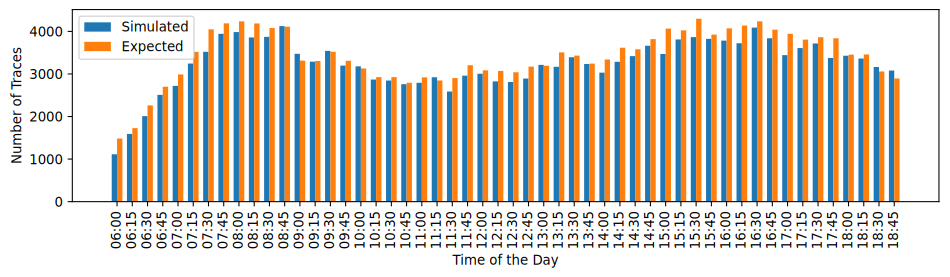
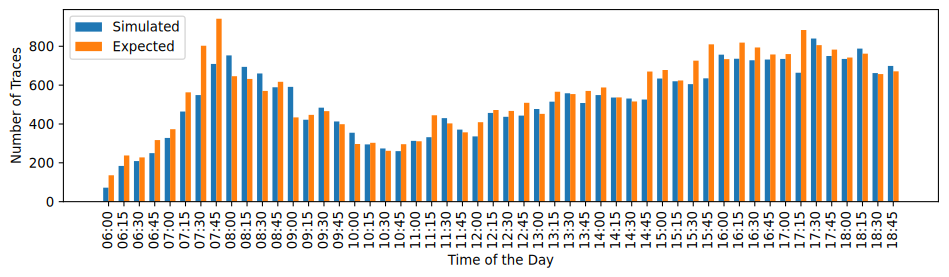

# HaTS - Hanover Traffic Scenario for SUMO

## General 

**Contact:** Nico Ostendorf [nico.ostendorf@de.bosch.com]

**Licence:** [CC-BY-SA-4.0](https://creativecommons.org/licenses/by-sa/4.0/deed.de)

The Hanover Traffic Scenario is a urban city SUMO scenario. It is based on traffic counts at seven different crossings in Hanover, Germany. The data is provided by the department of Planning and Urban Development of the city of Hanover.

The Scenario is primarily intented for the use with [Simulation of Urban MObility (SUMO)](https://eclipse.dev/sumo/) in combination with [Veins](https://veins.car2x.org/documentation/modules/) and its subproject Veins_INET.\
**Tested SUMO Versions:** 1.9, 1.8 \
**Tested VEINS Versions:** 5.2 \
For further informations about the simulator itself, please refer to the [SUMO Documentation](https://sumo.dlr.de/docs/index.html) or to the [Veins Documentation](https://veins.car2x.org/documentation/).

## How to cite it:
N. Ostendorf, K. Garlichs, L. C. Wolf, "HaTS - Hanover Traffic Scenario for SUMO"

## Start Scenario

HaTS Scenario can be launched directly with its configuration file:\
``` sumo -c osm.sumocfg```

## Statistics


*Figure 2: Comparison between expected traces from traffic counts and simulated traces of vehicles.*


*Figure 1: Comparison between expected traces from traffic counts and simulated traces of bicycles.*

*Table 1: Network Statistics*
| Parameter | Value |
| --------- | :------:|
|Total Area | 5.5 km²|
|Exclusive Vehicle Road Length| 48.9 km|
|Exclusive Bicycle Road Length| 107.5 km|
|Both Allowed Road Length| 67.6 km|
|Nodes| 1074|
|Edged| 2503|
|Traffic Lights| 42|
|Duration| 6 AM to 7 PM|

## Important things to know
- Settling time of 900 seconds
